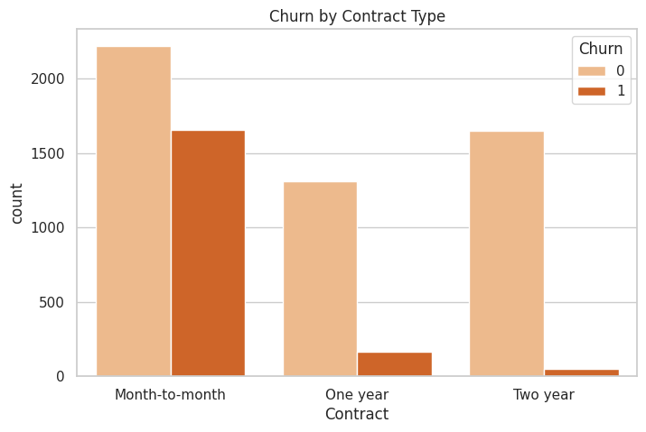
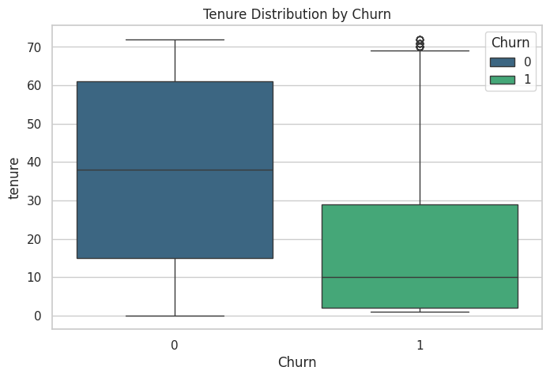
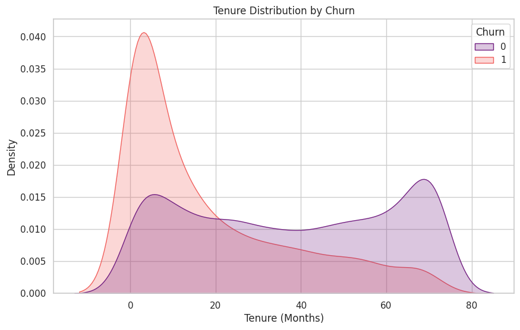
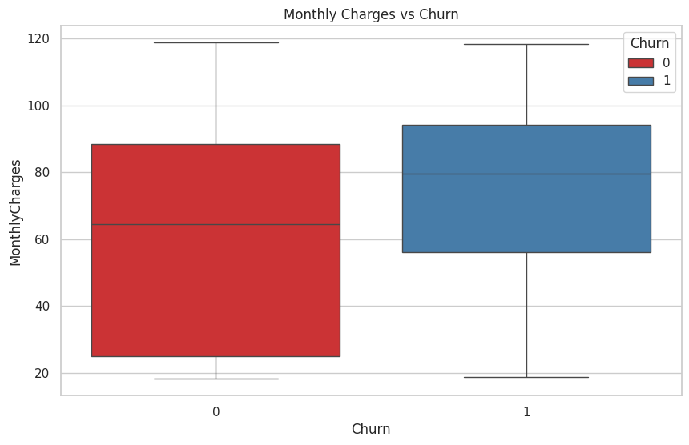
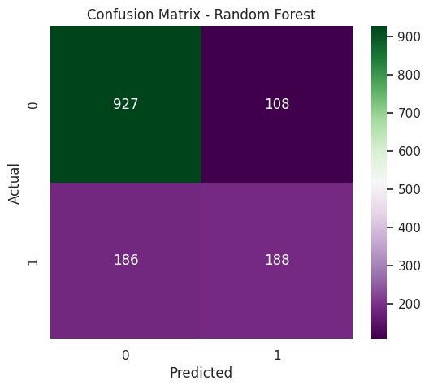

# 📊 Customer Churn Analysis – Telecom Industry

## Executive Summary
Customer churn is a critical challenge in the telecom industry, directly impacting revenue, customer lifetime value, and market share.  
This project analyzes customer churn behavior using historical telecom data and builds predictive machine learning models to identify customers who are likely to churn.

The goal is to enable **proactive, data-driven retention strategies** by combining exploratory data analysis, interpretable modeling, and actionable business insights.

---

## 📌 Business Problem
Customer churn occurs when a customer discontinues their subscription or service.

**In this project:**
- **Target variable:** `Churn` (Yes / No)
- **Business impact:** Losing customers is significantly more expensive than retaining them
- **Objective:** Predict customers likely to churn early enough to take retention actions

---

## 🎯 Project Objectives
- Understand behavioral and contractual drivers of churn  
- Build a **baseline interpretable model** (Logistic Regression)  
- Compare against an **advanced model** (Random Forest)  
- Evaluate models using business-relevant metrics  
- Translate predictions into **actionable business recommendations**

---

## 🗂 Dataset Overview
- Each row represents a unique telecom customer
- Features include:
  - Demographics (gender, senior citizen, dependents)
  - Service usage (internet, streaming, security, tech support)
  - Billing details (monthly charges, total charges)
  - Contract type and payment method
- Moderate class imbalance: ~26–27% churn rate

---

## 🔍 Exploratory Data Analysis (EDA)

### Churn by Contract Type
Customers on **month-to-month contracts** churn at significantly higher rates than those on long-term contracts.



---

### Tenure Distribution by Churn
Customers who churn tend to have **shorter tenure**, highlighting early-stage churn risk.



---

### Tenure vs Churn
Early-tenure customers are disproportionately represented among churners.



---

### Monthly Charges vs Churn
Customers with **higher monthly charges** show increased churn probability, indicating price sensitivity.



---

## 🛠 Feature Engineering
- Converted `TotalCharges` from string to numeric and handled missing values
- Dropped non-informative identifiers (`customerID`)
- Created **tenure groups** to represent customer lifecycle stages
- Applied one-hot encoding to categorical variables
- Ensured no multicollinearity using `drop_first=True`

---

## 🤖 Modeling Approach

### Baseline Model: Logistic Regression
**Why Logistic Regression?**
- Highly interpretable
- Business-friendly explanations
- Establishes a strong performance benchmark

### Advanced Model: Random Forest
**Why Random Forest?**
- Captures non-linear relationships
- Handles feature interactions
- Often improves predictive performance

**Trade-off:**
- Logistic Regression → Interpretability  
- Random Forest → Complexity & performance  

---

## 📈 Model Evaluation

### Key Metrics (Why They Matter)
- **Accuracy:** Can be misleading due to class imbalance
- **Precision:** Controls unnecessary retention spending
- **Recall (Most Important):** Measures ability to catch churners
- **ROC-AUC:** Overall discrimination power

---

### Model Performance Summary

| Model | Recall (Churn) | Precision (Churn) | ROC-AUC |
|------|---------------|------------------|--------|
| Logistic Regression | 0.53 | 0.66 | 0.84 |
| Random Forest | 0.50 | 0.64 | 0.83 |

Logistic Regression slightly outperforms Random Forest in recall and ROC-AUC, suggesting churn drivers are largely linear and interpretable.

---

### Confusion Matrix (Random Forest)



**Business Interpretation:**
- **False Negatives:** Missed churners → lost revenue
- **False Positives:** Unnecessary retention costs  

Recall is prioritized because losing customers is more costly than offering incentives.

---

## 🔎 Postdictive Analysis (Model Diagnosis)

**Key Findings:**
- Model performs well for:
  - Short-tenure customers
  - Month-to-month contracts
  - High monthly charges
- Model struggles with:
  - Long-tenure customers
  - Subtle or behavior-driven churn
  - Missing behavioral signals (support usage, service quality)

This highlights opportunities for improvement using behavioral and temporal features.

---

## 💡 Business Recommendations

### Priority Customer Segments
1. **High churn probability customers**
2. **High-value customers** (high monthly charges, multiple services)
3. **Short-tenure, high-charge customers**

---

### Recommended Actions
- **Contract upgrade incentives** (month-to-month → long-term)
- **Targeted loyalty discounts** for high-risk, high-value users
- **Enhanced onboarding programs** within first 90 days
- **Service bundling** to increase switching costs

---

### Estimated Business Impact
- Target top 20% highest-risk customers
- Expected churn reduction: **15–20% in targeted group**
- Overall churn reduction: **~3–5 percentage points**
- Increased customer lifetime value and reduced acquisition costs

---

## 📁 Repository Structure
``` 
customer-churn-analysis/
├── notebooks/
│   └── churn_analysis.ipynb
├── data/
│   └── Telco-Customer-Churn.csv
├── images/
│   ├── churn_by_contracttype.png
│   ├── confusion_matrix.png
│   ├── feature_importance.png
│   ├── monthlycharges_vs_churn.png
│   ├── tenure_by_churn.png
│   └── tenure_distribution_by_churn.png
├── README.md
└── requirements.txt
``` 

---

## 🧰 Tools & Technologies
- Python
- pandas, numpy
- scikit-learn
- matplotlib, seaborn
- Jupyter Notebook

---

## ✅ Final Notes
This project emphasizes:
- Clear business alignment
- Interpretable modeling
- Structured analytical workflow
- Actionable recommendations over complex algorithms

It reflects how machine learning should be applied in real-world business settings not just to predict, but to **drive decisions**.
